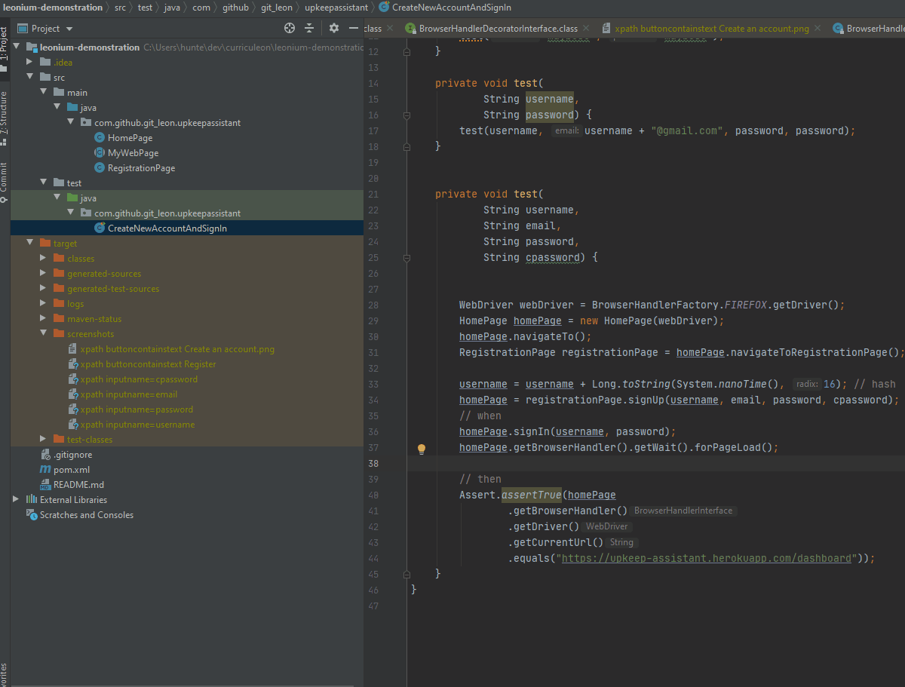

# Leonium Demonstration
* The purpose of this repository is to demonstrate the use of `Leonium`, a `Selenium` wrapper framework.

## Usage
* This dependency is hosted on [packagecloud.io](https://packagecloud.io/git-leon/utils/)


### Java Docs
* Click [here](./docs/index.html) to view the official java docs for this project.


### Step 1 - Add Maven Repository to `pom.xml`
* Because this dependency is hosted on a private server, not MavenCentral, the `pom.xml` must be configured to search in the proper repository.

```xml
<repositories>
  <repository>
    <id>git-leon-utils</id>
    <url>https://packagecloud.io/git-leon/utils/maven2</url>
    <releases>
      <enabled>true</enabled>
    </releases>
    <snapshots>
      <enabled>true</enabled>
    </snapshots>
  </repository>
</repositories>
```

### Step 2 - Add Maven Dependency to `pom.xml`
* To use this project, add the dependency to your `pom.xml`

```xml
<dependency>
  <groupId>com.github.git-leon</groupId>
  <artifactId>leonium</artifactId>
  <version>1.0</version>
</dependency>
```

### Sample Animation

#### Screenshot after every element


#### Screenshot on close only
